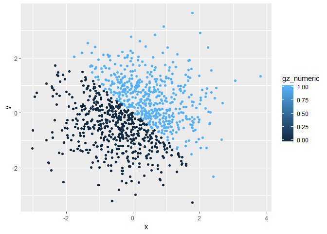
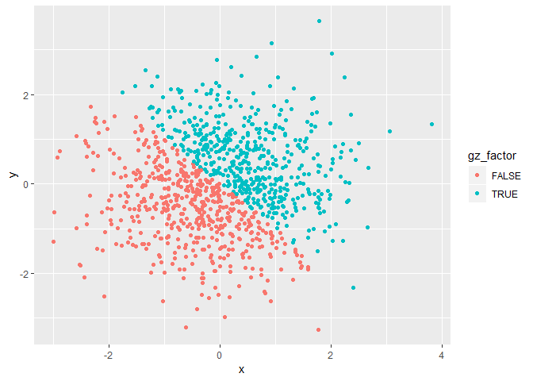

p8105\_hw1\_mp3653
================
Matthew Perrotta
September 18, 2018

Load Tidyverse package

``` r
library(tidyverse)
```

    ## -- Attaching packages --------------------------------------------------------------------------- tidyverse 1.2.1 --

    ## v ggplot2 3.0.0     v purrr   0.2.5
    ## v tibble  1.4.2     v dplyr   0.7.6
    ## v tidyr   0.8.1     v stringr 1.3.1
    ## v readr   1.1.1     v forcats 0.3.0

    ## -- Conflicts ------------------------------------------------------------------------------ tidyverse_conflicts() --
    ## x dplyr::filter() masks stats::filter()
    ## x dplyr::lag()    masks stats::lag()

**Problem 1**

Create a data frame

``` r
set.seed(1)

df_p1 = tibble(
  vec_numeric = runif(10, 1, 5),
  vec_logical = vec_numeric > 2,
  vec_char = c('Malaria', 'Ebola Virus', 'Influenza', 'MRSA', 'Poliovirus', 'Dengue', 'E. Coli', 'Measles', 'VZV', 'MERS'),
  vec_factor = factor(c('Parasite', 'Virus', 'Virus', 'Bacteria', 'Virus', 'Virus', 'Bacteria', 'Virus', 'Virus', 'Virus'))
)
```

Take the mean of each variable

``` r
mean(df_p1$vec_numeric)
```

    ## [1] 3.206055

``` r
mean(df_p1$vec_logical)
```

    ## [1] 0.8

``` r
mean(df_p1$vec_char)
```

    ## Warning in mean.default(df_p1$vec_char): argument is not numeric or
    ## logical: returning NA

    ## [1] NA

``` r
mean(df_p1$vec_factor)
```

    ## Warning in mean.default(df_p1$vec_factor): argument is not numeric or
    ## logical: returning NA

    ## [1] NA

the mean function provides a numeric output for the numeric and logical vectors and provides a NA output for the character and factor vectors. The numeric and logical vectors contain values that can be used in a mathematical function (the logical vector's TRUE/FALSE values can be seen as 1's and 0's) while the character and factor vectors contain non-numeric values.

Coercing logical, character, and factor variables to numeric

``` r
as.numeric(df$vec_logical)
as.numeric(df$vec_char)
as.numeric(df$vec_factor)
```

> When coercing the logical, character, and factor vectors the following happened:

-   The logical vector became a series of 1's and 0's, with 1's corresponding to true statements and 0's corresponding to false statements.
-   The character vector became a series of NA's
-   The factor vector became numeric values 1 through 3, with each number assigned to a specific value (1 = Bacteria, 2 = Parasite, 3 = Virus; number assignment seems to be alphabetical)

``` r
as.numeric(as.factor(df$vec_char))
as.numeric(as.character(df$vec_factor))
```

When the character vector was coerced to a factor vector, the values were assigned numeric levels by alphabetical order. When this factor vector was coerced to a numeric vector these numeric levels were outputted in the original order the character values were in.

When the factor vector was coerced to a character vector, the each value became a string of characters. When this character vector was coerced to a numeric vector the output was a series of NA's, as character strings cannot be coerced to numbers.

------------------------------------------------------------------------

**Problem 2**

Create a data frame

``` r
set.seed(1)

df_p2 = tibble(
  x = rnorm(1000),
  y = rnorm(1000),
  gz_logical = x + y > 0,
  gz_numeric = as.numeric(gz_logical),
  gz_factor = as.factor(gz_logical)
)
```

*Size of Dataset*

The data frame df\_p2 has 1000 rows and 5 columns. The variable x in df\_p2 has a mean of -0.0116481. The proportion of true statements is 0.49.

*Scatterplots* Plot 1. Scatterplot with points colored by logical vector

``` r
ggplot(df_p2, aes(x, y, color = gz_logical)) + geom_point()
```


    ## Saving 7 x 5 in image

The color scale for Plot 1 is binary reflecting the binary nature of the logical vector, with only two possible values of TRUE(1) or FALSE(0).

Plot 2. Scatterplot with points colored by numeric vector

``` r
ggplot(df_p2, aes(x, y, color = gz_numeric)) + geom_point()
```

 The color scale for Plot 2 is a continuous color gradation reflecting how R interprets numeric values. While there are only two values (1 and 0) in the numeric variable, R places the values on a continuous scale.

Plot 3. Scatterplot with points colored by logical vector

``` r
ggplot(df_p2, aes(x, y, color = gz_factor)) + geom_point()
```

 The color scale for Plot 3 is binary as the factor vector contains only two levels.

Save first plot to project directory

``` r
ggsave("./Plot_1.pdf")
```

    ## Saving 7 x 5 in image
